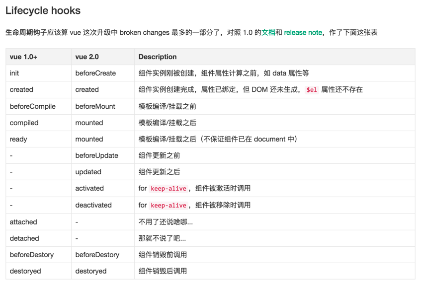

# Vue实例

每个 Vue.js 应用都是通过构造函数 Vue 创建一个 Vue 的根实例 启动的：

      var data = { a: 1 }
      var vm = new Vue({
        el: '#example',
        data: data
      })
      vm.$data === data // -> true
      vm.$el === document.getElementById('example') // -> true
      // $watch 是一个实例方法
      vm.$watch('a', function (newVal, oldVal) {
        // 这个回调将在 `vm.a`  改变后调用
      })
      
####生命周期图示

