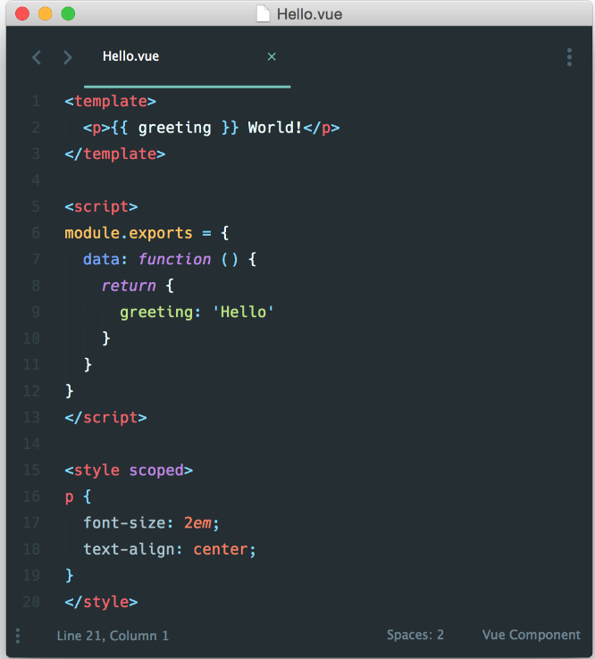

# 单文件组件

####介绍
在很多Vue项目中，我们使用 ```Vue.component``` 来定义全局组件，紧接着用 ```new Vue({ el: '#container '})``` 在每个页面内指定一个容器元素。


文件扩展名为 ```.vue ```的 single-file components(单文件组件) 为以上所有问题提供了解决方法，并且还可以使用 Webpack 或 Browserify 等构建工具。



####针对高级用户

无论你更钟情 Webpack 或是 Browserify，我们为简单的和更复杂的项目都提供了一些文档模板。我们建议浏览 [github.com/vuejs-templates](https://github.com/vuejs-templates)，找到你需要的部分，然后参考 README 中的说明，使用 [vue-cli](https://github.com/vuejs/vue-cli) 工具生成新的项目。

####style
如果添加```scoped```标签，所定义的style样式，只会应用在该组件里面。

因为它会自动添加动态属性值到该组件的每个标签里面：


####使用组件
```
import confirmDialog from '../../widget/confirmDialog.vue';
...
export default{
    components: {
            'vc-confirmDialog': confirmDialog
        },
}

```